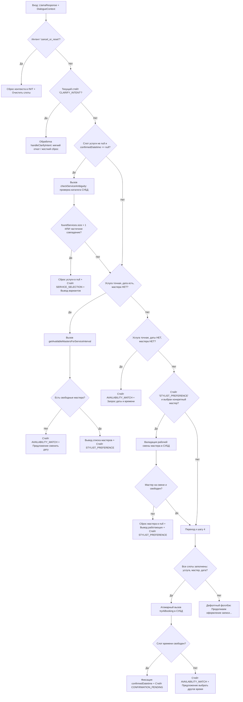

# Спецификация Детерминированного Конечного Автомата Диалогов (Dialogue State Machine)

Данный документ описывает архитектуру, состояния, правила переходов и защитные барьеры детерминированной стейт-машины ядра ИИ-ассистента салона красоты, реализованной в классе `SalonStateMachineService`.

## 1. Архитектурная философия

Когнитивный контур платформы построен на принципе **строгого разделения обязанностей (Separation of Concerns)**:
* **Недетерминированный слой (LLM Llama 3.2):** Выступает исключительно в роли изолированного, атомарного NLP-парсера текста. Модель не принимает бизнес-решений, не хранит историю чата в своей памяти и преобразует реплики клиента в плоский JSON-пакет интентов и слотов.
* **Детерминированный слой (Java State Machine):** Управляющее ядро на стороне Java принимает распознанные слоты, выполняет их слияние с персистентной памятью из базы данных PostgreSQL (через jOOQ) и вычисляет следующее состояние на основе жестких доменных правил и ограничений СУБД.

## 2. Карта Состояний (Dialogue States)

Граф диалога оперирует шестью базовыми состояниями:

| Состояние | Описание | Триггер выхода |
| :--- | :--- | :--- |
| **`INIT`** | Стартовое состояние новой сессии или сессии после сброса. | Извлечение любого валидного слота услуги. |
| **`SERVICE_SELECTION`** | Удержание пользователя на этапе выбора/уточнения бьюти-процедуры. | Успешное разрешение амбивалентности (строго 1 точное совпадение в каталоге СУБД). |
| **`AVAILABILITY_MATCH`** | Этап подбора свободного временного окна под график мастеров салона. | Корректное распознавание даты и времени через `DateTimeParser`. |
| **`STYLIST_PREFERENCE`** | Опрос предпочтений клиента по мастеру (выбор конкретного стилиста или маркер `ANY`). | Валидация рабочей смены мастера на выбранную дату в СУБД. |
| **`CONFIRMATION_PENDING`** | Ожидание финального подтверждения записи («Да»/«Нет») от клиента. | Атомарный перевод визита из статуса `AI_PENDING` в `APPROVED` или `CANCELED`. |
| **`CLARIFY_INTENT`** | Промежуточный буфер разрешения размытых/амбивалентных отказов на этапе подтверждения. | Выбор явного пути: жесткий сброс сессии или мягкий откат на выбор даты. |

## 3. Глобальные Защитные Барьеры и Правила Валидации

### 3.1 Барьер Амбивалентности Категорий Услуг (Service Ambiguity Check)
Самый верхний и критически важный рубеж стейт-машины, защищающий расписание от нечетких фраз (*«хочу на стрижку»*). Вызывает метод `bookingService.searchServicesInCatalog(rawInput)` и оценивает результаты по двум векторам:
* **Множественный выбор (`foundServices.size() > 1`):** Если под поисковый запрос подходит несколько позиций из базы (Мужская, Женская, Детская стрижки), автомат сбрасывает слот услуги в `null` через хелпер `clearServiceSlot`, принудительно переключает стейт в `SERVICE_SELECTION` и выводит перечень вариантов.
* **Неполное/Частичное совпадение (`!isExactMatch`):** Если база вернула всего 1 результат, но его официальное имя не совпадает точь-в-точь с тем, что написал клиент (в базе *"Женская стрижка модельная"*, а клиент написал *"стрижка"*), система запрещает автоматический выбор. Слот обнуляется, стейт удерживает `SERVICE_SELECTION`, а пользователю отправляется запрос на подтверждение конкретного наименования.

### 3.2 Метод Безопасного Слияния Слотов (`updateWith`)
Чтобы защитить контекст от затирания валидных данных пустыми токенами от LLM (так как Llama 3.2 вместо отсутствующих параметров часто присылает пустые строки `""`), маппинг на уровне Java-рекорда блокирует пустые строки с помощью проверок `.isBlank()`. Пустые строки принудительно приравниваются к `null` и не перезаписывают память.

## 4. Спецификация Бизнес-Логики Ходов (Pipeline Execution Order)

Каждый вызов метода `processTurn` проходит последовательную цепочку проверок сверху вниз:

## 5. Матрица Тестирования (SLA & Quality Assurance)

Для обеспечения 100% стабильности логики и исключения регрессионных багов, стейт-машина полностью покрыта двумя уровнями автоматических тестов в рамках Gradle-архитектуры:
* **Компонентные тесты в памяти (`AiAssistantServiceImplTest`):** Используют легкий рантэйм `@InjectTest` от Avaje. Полностью изолируют стейт-машину от сети и диска через `@Mock` для портов репозиториев, проверяя правильность многотуровых разговорных цепочек (Happy Path) и мгновенный сброс параметров при обнаружении амбивалентности за микросекунды.
* **Сквозные интеграционные тесты (`SalonBookingFunnelE2ETest`):** Находятся в модуле `salon-e2e-test`, используют Avaje HTTP Client для отправки реальных последовательных POST-запросов к серверу и проверяют, что реальный пользователь в Telegram пройдет по воронке *«Уточнение вида стрижки -> Оффер мастеров -> Холдинг AI_PENDING»* без единого технического сбоя.
